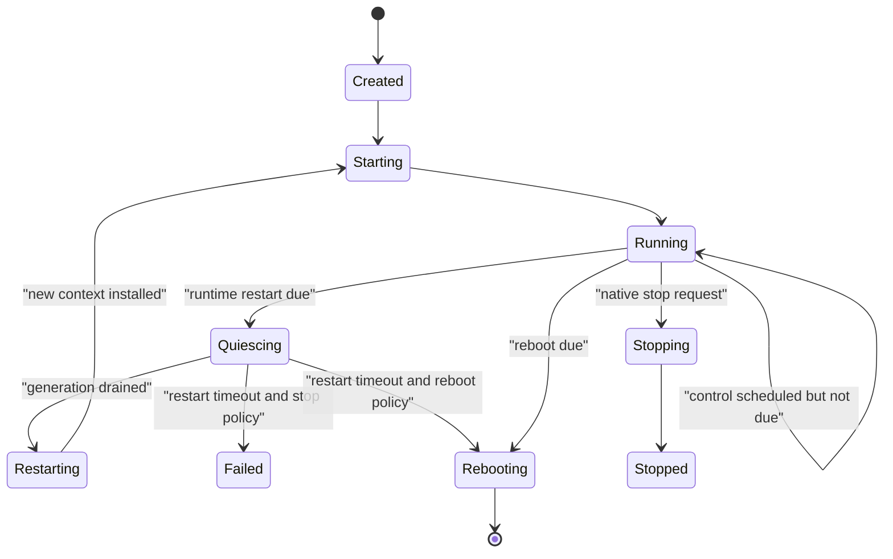

# System Management API v1

Status: implemented for the unreleased Host API v1. Board-backed reboot and
long-run restart soak checks remain part of release validation.

This document defines the implemented `sys` surface for the unreleased Host API
v1. `ESP32QJS_HOST_API_VERSION` remains `1`. There is no compatibility period,
deprecated alias, or v2 namespace: the former flat `sys.info()` result was
replaced in place throughout the framework, device Agent, tests, declarations,
and documentation.

The design keeps `sys` focused on platform identity, diagnostics, and runtime
lifecycle. Peripheral operations remain in literal modules such as `gpio`,
`i2c`, `spi`, `uart`, `wifi`, and `http`.

## Decisions

- `sys.info` is a read-only, lazily evaluated property tree for facts that are
  stable for a runtime configuration or physical boot.
- `sys.status` is a read-only, lazily evaluated property tree for live system
  state.
- `sys.time` owns transport-neutral wall-clock status and synchronization.
  Network modules only establish connectivity; they do not own system time.
- Namespace objects are created once when globals are installed. Reading a leaf
  getter creates only that scalar or small detached snapshot.
- `sys.tasks(options?)` remains an explicit diagnostic operation because a full
  FreeRTOS task snapshot allocates a native buffer and briefly pauses scheduler
  observation.
- `sys.restartRuntime(options?)` restarts only the JavaScript runtime generation.
- `sys.reboot(options?)` performs a full software reboot.
- `sys.config()`, `sys.config(key)`, `millis()`, `micros()`, `freeHeap()`, `randomHex()`, and
  `withTimeout()` remain lightweight operations. `freeHeap()` is explicitly the
  low-allocation convenience form of `sys.status.memory.default.freeBytes`.
- All public sizes carry a `Bytes` suffix, frequencies carry a `Hz` suffix, and
  durations carry an `Ms` suffix.
- Unsupported optional observations return `null` or an explicit capability
  flag. They never fabricate data.
- Raw RTOS handles, pointers, task deletion, task suspension, task-priority
  mutation, watchdog feeding, and multi-task JavaScript execution are not
  exposed.

## Goals

- Let application and operator code inspect hardware, memory, boot state,
  FreeRTOS health, and JavaScript-runtime health without allocating one large
  aggregate object.
- Give the runtime a clean, bounded JavaScript-only restart path that closes all
  resources owned by the outgoing generation.
- Keep full-device reboot distinct from JavaScript-runtime restart.
- Preserve one single-threaded JavaScript execution model and the existing
  `Future`/`EventQueue` scheduler.
- Make every expensive or potentially disruptive diagnostic operation
  explicit.
- Provide enough status for leak detection, recovery, and remote device
  management without turning `sys` into a peripheral or policy module.

## Non-goals

- GPIO, bus, radio, display, storage, or transport operations duplicated under
  `sys`. System wall-clock management remains under `sys.time` and uses an
  already active network interface.
- A JavaScript API for creating arbitrary FreeRTOS tasks.
- Killing, suspending, resuming, pinning, or reprioritizing native tasks.
- CPU-frequency mutation, light sleep, deep sleep, wake-source configuration,
  temperature sensing, OTA, factory reset, or safe-mode policy. Power management
  and OTA/recovery require separate focused designs.
- Pretending that the current MQuickJS engine exposes exact live JavaScript heap
  usage. v1 reports the configured JS arena, while dynamic JS arena usage stays
  absent until the engine has a stable public measurement API.
- Making multiple independently read live getters look like one atomic system
  snapshot.

## Public JavaScript Surface

The declaration shape below is normative. Interfaces describe native namespace
objects and getter results; they do not imply that one large object is allocated.

```ts
declare namespace ESP32QJS {
  type SysPsramMode = "none" | "quad" | "octal";
  type SysSchedulerState = "not-started" | "running" | "suspended";
  type SysTaskState =
    | "running"
    | "ready"
    | "blocked"
    | "suspended"
    | "deleted"
    | "invalid";
  type SysRuntimeState =
    | "created"
    | "starting"
    | "running"
    | "quiescing"
    | "restarting"
    | "stopping"
    | "stopped"
    | "failed";
  type SysControlAction = "restart-runtime" | "reboot";
  type SysRestartFailureAction = "reboot" | "stop";

  interface SysVersionInfo {
    readonly framework: string;
    readonly hostApi: 1;
    readonly mquickjs: string;
    readonly espIdf: string;
  }

  interface SysFeatures {
    readonly fs: boolean;
    readonly nvs: boolean;
    readonly gpio: boolean;
    readonly ledc: boolean;
    readonly adc: boolean;
    readonly dac: boolean;
    readonly i2c: boolean;
    readonly spi: boolean;
    readonly uart: boolean;
    readonly net: boolean;
    readonly usbSerial: boolean;
    readonly socket: boolean;
    readonly websocket: boolean;
    readonly bitmap: boolean;
    readonly bitmapJpeg: boolean;
    readonly wifi: boolean;
    readonly tls: boolean;
    readonly http: boolean;
    readonly httpServer: boolean;
    readonly runtimeLogs: boolean;
  }

  interface SysChipRevision {
    raw: number;
    major: number;
    minor: number;
  }

  interface SysChipCapabilities {
    embeddedFlash: boolean;
    wifi: boolean;
    ble: boolean;
    bluetoothClassic: boolean;
    ieee802154: boolean;
    embeddedPsram: boolean;
  }

  interface SysChipInfo {
    model: string;
    revision: SysChipRevision;
    cores: number;
    capabilities: SysChipCapabilities;
  }

  interface SysCpuInfo {
    configuredFrequencyHz: number;
  }

  interface SysFlashInfo {
    sizeBytes: number;
  }

  interface SysPsramInfo {
    enabled: boolean;
    sizeBytes: number;
    mode: SysPsramMode;
  }

  interface SysHardwareInfo {
    readonly hardwareId: string | null;
    readonly target: string;
    readonly chip: SysChipInfo;
    readonly cpu: SysCpuInfo;
    readonly flash: SysFlashInfo;
    readonly psram: SysPsramInfo;
  }

  interface SysRuntimeHeapInfo {
    sizeBytes: number;
    region: "internal" | "psram";
  }

  interface SysRuntimeTaskInfo {
    name: string;
    stackSizeBytes: number;
    priority: number;
    watchdogEnabled: boolean;
  }

  interface SysRuntimeStartupInfo {
    script: string;
    autorun: boolean;
    repl: boolean;
  }

  interface SysRuntimeSecondaryFilesystemInfo {
    partition: string;
    root: string;
    required: boolean;
  }

  interface SysRuntimeFilesystemInfo {
    root: string;
    mount: boolean;
    required: boolean;
    readOnly: boolean;
    formatOnMountFail: boolean;
    secondary: SysRuntimeSecondaryFilesystemInfo | null;
  }

  interface SysRuntimeControlInfo {
    restartRuntime: boolean;
    reboot: boolean;
    restartTimeoutMs: number | null;
    restartFailureAction: SysRestartFailureAction | null;
  }

  interface SysRuntimeInfo {
    readonly heap: SysRuntimeHeapInfo;
    readonly task: SysRuntimeTaskInfo | null;
    readonly evalTimeoutMs: number;
    readonly startup: SysRuntimeStartupInfo | null;
    readonly filesystem: SysRuntimeFilesystemInfo | null;
    readonly control: SysRuntimeControlInfo;
  }

  interface SysInfo {
    readonly version: SysVersionInfo;
    readonly hardware: SysHardwareInfo;
    readonly features: SysFeatures;
    readonly runtime: SysRuntimeInfo;
  }

  interface SysResetStatus {
    code: number;
    name: string;
  }

  interface SysWakeupStatus {
    mask: number;
    names: string[];
  }

  interface SysBootStatus {
    readonly bootId: string;
    readonly uptimeMs: number;
    readonly reset: SysResetStatus;
    readonly wakeup: SysWakeupStatus;
    readonly softwareReason: string | null;
  }

  interface SysCpuStatus {
    readonly frequencyHz: number | null;
  }

  interface SysHeapStatus {
    totalBytes: number;
    freeBytes: number;
    allocatedBytes: number;
    minimumFreeBytes: number;
    largestFreeBlockBytes: number;
    allocatedBlocks: number;
    freeBlocks: number;
    totalBlocks: number;
  }

  type SysMemoryPressure = "normal" | "guarded" | "critical";

  interface SysMemoryManagerStatus {
    pressure: SysMemoryPressure;
    internalReserveBytes: number;
    dmaLargestReserveBytes: number;
    managedInternalBytes: number;
    managedPsramBytes: number;
    /** Managed pinned blocks plus driver DMA payloads and staging pools. */
    pinnedBytes: number;
    driverPinnedBytes: number;
    stagingPinnedBytes: number;
    dmaStagingPools: number;
    pendingDmaReservationBytes: number;
    movableIdleBytes: number;
    migrationCount: number;
    migrationBytes: number;
    evictionCount: number;
    allocationFailures: number;
  }

  interface SysMemoryStatus {
    readonly default: SysHeapStatus;
    readonly internal: SysHeapStatus;
    readonly dma: SysHeapStatus;
    readonly psram: SysHeapStatus | null;
    readonly manager: SysMemoryManagerStatus;
  }

  interface SysRuntimeTaskStatus {
    name: string;
    priority: number;
    currentCore: number;
    stackSizeBytes: number | null;
    stackHighWaterMarkBytes: number;
    watchdogEnabled: boolean;
    watchdogRegistered: boolean;
  }

  interface SysRtosStatus {
    readonly name: "FreeRTOS";
    readonly schedulerState: SysSchedulerState;
    readonly tickRateHz: number;
    readonly taskCount: number;
    readonly runtimeTask: SysRuntimeTaskStatus;
    readonly taskSnapshotSupported: boolean;
    readonly taskSnapshotLimit: number;
  }

  interface SysTimerResourceStatus {
    active: number;
    capacity: number;
  }

  interface SysFutureResourceStatus {
    queued: number;
    pending: number;
    capacity: number;
    userCapacity: number;
    internalReserve: number;
  }

  interface SysEventQueueResourceStatus {
    open: number;
    dropped: number;
  }

  interface SysAsyncPollerResourceStatus {
    registered: number;
    capacity: number;
  }

  interface SysOrphanResourceStatus {
    pending: number;
    capacity: number;
  }

  interface SysRuntimeResourcesStatus {
    timers: SysTimerResourceStatus;
    futures: SysFutureResourceStatus;
    eventQueues: SysEventQueueResourceStatus;
    asyncPollers: SysAsyncPollerResourceStatus;
    orphans: SysOrphanResourceStatus;
  }

  interface SysRuntimeFilesystemStatus {
    root: string;
    mounted: boolean;
    readOnly: boolean;
    secondaryMounted: boolean;
  }

  interface SysRuntimeWatchdogStatus {
    systemEnabled: boolean;
    systemRegistered: boolean;
    jsEnabled: boolean;
    jsRegistered: boolean;
    timeoutMs: number;
    lastOuterHeartbeatAgeMs: number;
  }

  interface SysRuntimeStartupStatus {
    phase: "armed" | "stabilizing" | "healthy" | "safe-mode";
    safeModeActive: boolean;
    safeModeRequested: boolean;
    failureCount: number;
    failureLimit: number;
    healthyAfterMs: number;
    lastFailureReason: string | null;
  }

  interface SysPendingControl {
    action: SysControlAction;
    reason: string;
    requestedAtMs: number;
    dueAtMs: number;
  }

  interface SysRuntimeStatus {
    readonly state: SysRuntimeState;
    readonly generation: number;
    readonly uptimeMs: number;
    readonly restartCount: number;
    readonly lastRestartReason: string | null;
    readonly pendingControl: SysPendingControl | null;
    readonly filesystem: SysRuntimeFilesystemStatus;
    readonly resources: SysRuntimeResourcesStatus;
    readonly watchdog: SysRuntimeWatchdogStatus;
    readonly startup: SysRuntimeStartupStatus;
  }

  interface SysStatus {
    readonly boot: SysBootStatus;
    readonly cpu: SysCpuStatus;
    readonly memory: SysMemoryStatus;
    readonly rtos: SysRtosStatus;
    readonly runtime: SysRuntimeStatus;
  }

  interface SysTaskOptions {
    limit?: number;
  }

  interface SysTaskInfo {
    id: number;
    name: string;
    state: SysTaskState;
    priority: number;
    basePriority: number;
    core: number | null;
    stackHighWaterMarkBytes: number;
  }

  interface SysTaskSnapshot {
    total: number;
    truncated: boolean;
    tasks: SysTaskInfo[];
  }

  interface SysControlOptions {
    reason?: string;
    delayMs?: number;
  }

  interface SysControlReceipt {
    action: SysControlAction;
    reason: string;
    generation: number;
    requestedAtMs: number;
    dueAtMs: number;
  }

  interface SysTimeSyncOptions {
    servers: string[];
    /** Integer timeout from 1 through 60000 milliseconds. Defaults to 15000. */
    timeoutMs?: number;
  }

  interface SysTimeSyncResult {
    synchronized: true;
    unixTimeMs: number;
  }

  interface SysTimeStatus {
    synchronized: boolean;
    synchronizing: boolean;
    unixTimeMs: number | null;
  }

  interface SysTimeModule {
    status(): SysTimeStatus;
    /** Rejects with TIME_SYNC_BUSY while another SNTP operation is active. */
    sync(options: SysTimeSyncOptions): SysTimeSyncResult;
  }

  interface SysModule {
    readonly info: SysInfo;
    readonly status: SysStatus;
    readonly time: SysTimeModule;
    safeMode: boolean;

    config(key: string): string | number | boolean | undefined;
    tasks(options?: SysTaskOptions): SysTaskSnapshot;
    restartRuntime(options?: SysControlOptions): SysControlReceipt;
    reboot(options?: SysControlOptions): SysControlReceipt;

    millis(): number;
    micros(): number;
    freeHeap(): number;
    randomHex(byteLength: number): string;
    withTimeout<T>(timeoutMs: number, callback: () => T): T;
  }
  }
```

`resources.orphans` reports native resources whose JavaScript owner was
finalized before teardown could complete. The runtime retries at a bounded safe
point; `pending` never exceeds the fixed `capacity`, and a reaper never invokes
JavaScript.

`tls` is a build capability rather than a global JavaScript namespace. When it
is false, HTTPS and secure TCP sockets are unavailable, the public CA bundle is
not linked, and the HTTP client and Socket modules can still provide plaintext
transports. The current WebSocket client module depends on TLS because its
ESP-IDF transport component combines WS and WSS. Wi-Fi Enterprise EAP-TLS is
also excluded; ordinary WPA2/WPA3 personal Wi-Fi remains available.

The global remains:

```ts
declare var sys: ESP32QJS.SysModule;
```

`SysInfo`, `SysStatus`, and `SysTimeModule` are TypeScript interface names only.
They are not additional runtime constructors or globals. Their runtime entry
points are the `sys.info`, `sys.status`, and `sys.time` namespace properties.

## Lazy Getter Semantics

`sys`, `sys.info`, `sys.info.version`, `sys.info.hardware`,
`sys.info.features`, `sys.info.runtime`, `sys.status`, `sys.status.boot`,
`sys.status.cpu`, `sys.status.memory`, `sys.status.rtos`, and
`sys.status.runtime`, plus `sys.time`, are singleton native namespace objects
installed with the standard globals. `sys.time` uses explicit methods because
status collection and network synchronization are operations rather than lazy
property reads.

Their public data properties are enumerable getter-only properties:

- Reading a scalar getter returns the scalar without creating sibling data.
- Reading a structured leaf such as `sys.info.hardware.chip`,
  `sys.status.memory.internal`, or `sys.status.runtime.resources` creates one
  fresh detached plain object for that leaf only.
- Re-reading a live getter takes a new measurement.
- Mutating a returned detached object changes only that JavaScript object. It
  never writes through to native state.
- Assigning a namespace getter is ignored by non-strict JavaScript and throws
  under strict JavaScript according to ordinary getter-only property semantics.
- `Object.keys(...)` lists getter names without sampling them.
- `JSON.stringify(sys.info)` or `JSON.stringify(sys.status)` intentionally walks
  every enumerable getter and therefore performs a full sequential collection.
  Callers that need a bounded result should project only selected leaves.
- A full serialization is not atomic. Each live leaf records the state at the
  instant that getter runs. Fields within one returned leaf are captured from
  one native helper invocation and are internally consistent.

Targeted inspection uses only the required branches:

```js
(function () {
    var chip = sys.info.hardware.chip;
    var heap = sys.status.memory.internal;
    return {
        hardwareId: sys.info.hardware.hardwareId,
        model: chip.model,
        revision: chip.revision,
        freeBytes: heap.freeBytes,
        largestFreeBlockBytes: heap.largestFreeBlockBytes
    };
})()
```

## Information Tree

### Versions

`sys.info.version` exposes four independent scalar getters:

- `framework`: framework SemVer, currently the unreleased `0.1.0` line.
- `hostApi`: the integer `1`. This redesign does not create Host API v2.
- `mquickjs`: the exact vendored MQuickJS release.
- `espIdf`: `esp_get_idf_version()` from the running image.

### Hardware

`sys.info.hardware` contains physical or build-target facts:

- `hardwareId` is `hw-` plus the lowercase factory eFuse Base MAC. It remains
  stable across runtime restart, reboot, erase, and firmware replacement.
- `target` is the lowercase ESP-IDF target such as `esp32c3` or `esp32s3`.
- `chip` is one snapshot from `esp_chip_info()`. Revision is decoded from the
  ESP-IDF `MXX` representation into `{ raw, major, minor }`; the raw value is
  retained for forward compatibility.
- `chip.capabilities` reports silicon flags. It is deliberately different from
  `sys.info.features`, which reports compiled JavaScript modules.
- `cpu.configuredFrequencyHz` is the configured maximum/default application CPU
  frequency. The live clock belongs to `sys.status.cpu.frequencyHz`.
- `flash.sizeBytes` comes from the physical Flash chip query.
- `psram` always has one shape. An unavailable or uninitialized device returns
  `{ enabled: false, sizeBytes: 0, mode: "none" }`.

Board wiring does not belong in system identity. Applications enumerate the
selected immutable profile with `sys.config()`, read individual values through
`sys.config(key)`, and use module constants such as `gpio.USER_LED_PIN`. The
redesign removes `userLedPin` and `userLedActiveLow` from system information.

### Compiled Features

Every `sys.info.features.<name>` member is a scalar native boolean getter. A
disabled optional module is not installed as a global, and its feature getter
returns `false`. `runtimeLogs` is included so the declarations match the actual
build capability.

### Runtime Configuration

`sys.info.runtime` describes configuration, not live state:

- `heap`: dedicated MQuickJS arena size and physical region.
- `task`: default runtime-task name, stack size, priority, and configured
  watchdog policy. It is `null` for a low-level embedder that did not provide a
  managed runtime host.
- `evalTimeoutMs`: default JavaScript evaluation/callback deadline.
- `startup`: configured script, autorun policy, and REPL policy, or `null` for a
  low-level embedder.
- `filesystem`: mount policy and roots, or `null` for a low-level embedder.
- `control`: capability and configured restart-failure policy. Control methods
  remain installed even when a low-level embedder reports them unavailable; an
  unavailable call throws a clear `InternalError`. When restart is unavailable,
  its timeout and failure policy are `null` rather than invented defaults.

## Live Status Tree

### Boot

`sys.status.boot.bootId` is a random 64-bit lowercase hexadecimal identifier for
one physical firmware boot. It is created outside the JavaScript generation and
remains unchanged across `restartRuntime()`.

`reset` contains the raw `esp_reset_reason_t` numeric value and a normalized
lowercase name. Known names include `unknown`, `power-on`, `external`,
`software`, `panic`, `interrupt-watchdog`, `task-watchdog`, `watchdog`,
`deep-sleep`, `brownout`, `sdio`, `usb`, `jtag`, `efuse`, `power-glitch`, and
`cpu-lockup`. An unrecognized future ESP-IDF value keeps its raw code and uses
`unknown`.

Wakeup information is a mask plus an array because newer ESP-IDF releases can
report multiple simultaneous wake sources. Builds against an older supported
ESP-IDF that exposes only a singular wake cause adapt it into the same array
shape.

Before `reboot()`, the runtime stores a bounded software reason in RTC-retained
memory with a magic value and checksum. On the next boot it validates and copies
that reason into boot state, then clears the retained marker. Power loss or an
invalid marker yields `null` without writing NVS or wearing Flash.

### CPU

`sys.status.cpu.frequencyHz` uses the public clock-tree query for the current CPU
clock. A target or ESP-IDF combination that cannot provide a reliable value
returns `null`.

### Memory

Each memory leaf calls `heap_caps_get_info()` for one capability view:

- `default`: `MALLOC_CAP_DEFAULT`.
- `internal`: `MALLOC_CAP_INTERNAL | MALLOC_CAP_8BIT`.
- `dma`: `MALLOC_CAP_DMA`.
- `psram`: `MALLOC_CAP_SPIRAM`, or `null` when PSRAM is unavailable.

Capability views overlap. They are alternative allocation views and must never
be added together. `totalBytes` is `freeBytes + allocatedBytes` for that view;
the remaining fields map directly to ESP-IDF heap metadata. No synthetic
fragmentation percentage is reported because one percentage obscures region and
allocation-capability differences.

`sys.freeHeap()` and `sys.status.memory.default.freeBytes` call the same native
helper and have identical meaning. The former exists for tight loops that should
not allocate a `SysHeapStatus` object. On PSRAM systems the default view may be
dominated by external memory, so it is not a TLS- or DMA-capacity signal. Use
the `internal`, `dma`, and `psram` views' `largestFreeBlockBytes` and
`minimumFreeBytes` values when diagnosing allocation failures or a downward
fragmentation trend.

`sys.status.memory.manager` reports the framework allocator rather than another
heap capability view. At runtime startup it derives an internal-free reserve
and an internal-DMA largest-block reserve from the available heaps. `guarded`
means either reserve has been crossed; `critical` means a reserve has fallen
below half its startup-derived value. The policy uses internal/DMA metrics and
never treats aggregate `freeHeap()` as proof that a driver allocation can
succeed.

Framework payloads declare their memory class. File, network, serial, font,
bitmap, and media payloads prefer PSRAM when it is available. ISR state, task
state, I2S DMA descriptors, and driver-owned objects remain pinned in internal
memory. Movable buffers use stable native handles and are relocated only at a
runtime safe point while no borrow is active. Generation teardown releases any
stable blocks left after JavaScript finalizers, so a runtime restart cannot
retain ownerless buffers from the previous generation. The managed-byte and
`movableIdleBytes` counters cover stable managed blocks; allocation-failure
counts cover classified payload, block, and DMA reservation requests. Driver
integrations may register an exact, public payload size after ESP-IDF
initialization. I2S does this for its persistent PCM DMA buffers; opaque
ESP-IDF metadata and unregistered third-party allocations remain outside the
counters.

The internal `DMA_EXTERNAL` class means "prefer external DMA". If the target SoC
supports DMA access to initialized PSRAM, allocation and reallocation try PSRAM
first. This deliberately does not look for a `SPIRAM | DMA` heap intersection:
ESP-IDF registers PSRAM without the `MALLOC_CAP_DMA` heap tag and applies the
required DMA alignment when processing the allocation request. The manager also
verifies the resulting pointer with the target's external-DMA predicate. If
PSRAM is fragmented or exhausted, the manager makes one internal-DMA attempt
only when the internal reserve check allows the full request. A target without
external DMA goes directly to the same reserve-checked internal path. The
manager never alternates repeatedly between heaps, and records one
allocation failure only after both permitted attempts fail. Code that always
requires internal DMA uses `DMA_INTERNAL` explicitly.

`pinnedBytes` counts every internal stable managed block whose class is
non-movable, including `DMA_EXTERNAL` blocks that fell back to internal RAM,
plus registered driver DMA payloads and committed staging pools.
`driverPinnedBytes` isolates persistent driver payloads;
`stagingPinnedBytes` and `dmaStagingPools` isolate reusable internal DMA
staging workspaces. `pendingDmaReservationBytes` reports allocations admitted
by policy but not yet committed by the driver. Movable-class blocks are excluded even while
temporarily borrowed; `movableIdleBytes` separately reports movable blocks
that are currently idle. Raw payload helpers and opaque driver metadata remain
outside these values.

On targets without PSRAM the same classification and reserve checks remain in
force, but migration is disabled. Pressure maintenance runs only after active
JavaScript execution has unwound; recursive scheduler polls used by cooperative
USB, UART, and Future waits do not relocate blocks. Driver-task allocation
helpers and DMA reservation calls never relocate blocks. A failed classified
allocation returns the operation's normal out-of-memory error instead of trying
progressively smaller driver layouts.

### RTOS

The cheap RTOS getters are always available:

- scheduler state from `xTaskGetSchedulerState()`;
- tick rate from `configTICK_RATE_HZ`;
- current task count from `uxTaskGetNumberOfTasks()`;
- current JavaScript runtime-task name, priority, current core, stack high-water
  mark in ESP-IDF bytes, and watchdog state.

The configured runtime-task stack size is supplied by the managed runtime host.
It is `null` for an unmanaged low-level embedder. `watchdogEnabled` means policy
requested subscription; `watchdogRegistered` reports whether registration
actually succeeded for the running generation.

### Watchdogs and Startup Recovery

`sys.status.runtime.watchdog` distinguishes the ordinary runtime-task watchdog
from the independent outer-JavaScript watchdog. VM interrupt checks may feed
the former. A return to the outer scheduler or progress inside a
framework-owned native wait feeds the latter, so legitimate `Future.wait()`
and network deadlines may exceed the watchdog interval. Tight JavaScript that
never enters a native wait still causes a reboot. The Agent profile configures
both to 15 seconds.

`sys.status.runtime.startup` reports the persisted startup guard. Before the
startup script runs, `phase` is `armed`; after it returns, the runtime remains
`stabilizing` for the configured 30-second healthy window. A watchdog/panic
reset while armed or stabilizing, or an uncaught startup exception, increments
`failureCount`. Two consecutive failures latch the next boot into `safe-mode`.
The generic framework does not decide what application code safe mode skips.
For a required secondary LittleFS partition, consecutive mount failures use the
same counter; once latched, the runtime starts with `secondaryMounted: false`
so application-owned recovery services can remain reachable.

`sys.safeMode` is the persistent operator latch. Assigning `false` clears the
failure count and latch for the next boot; it does not change which code was
loaded in the current boot. Repair the workspace first, then use:

```js
sys.safeMode = false;
sys.reboot({ reason: "safe-mode-repaired" });
```

Application startup code must not read or assign this recovery control. A host
or system application owns the safe-mode policy. The ESP32QJS Agent exposes
this through its reboot control only after the workspace mount is healthy.

### Runtime Generation

A runtime generation is one MQuickJS context plus everything owned through that
context. Generation numbers start at `1` after the first context is installed.
A successful JavaScript-only restart increments both `generation` and
`restartCount`; a full device reboot starts again at generation `1`.

`runtime.resources` reports only bounded framework-core resources:

- allocated JS timers;
- queued and pending Future slots;
- open EventQueues and their aggregate dropped-event count;
- registered generic async pollers.

It does not pretend to be a universal list of every ESP-IDF object. Individual
modules retain responsibility for their own detailed `status()` methods.

## FreeRTOS Task Snapshot

`sys.tasks(options?)` is a diagnostic operation, not a property getter.

```js
var snapshot = sys.tasks({ limit: 16 });
print(JSON.stringify(snapshot.tasks));
```

Rules:

- The feature is controlled by `CONFIG_ESP32_MQUICKJS_SYS_TASK_SNAPSHOT`.
- Enabling it selects `CONFIG_FREERTOS_USE_TRACE_FACILITY`; it does not enable
  formatted stats or run-time CPU accounting.
- `CONFIG_ESP32_MQUICKJS_SYS_TASK_SNAPSHOT_MAX` bounds the native
  `TaskStatus_t` allocation and returned entries, with range `1..64` and default
  `32`.
- `limit` is an integer from `1` through the configured maximum and defaults to
  that maximum.
- If the current system task count exceeds the configured native maximum, the
  call throws `InternalError` instead of returning a misleading partial native
  snapshot. The cheap `sys.status.rtos.taskCount` remains available.
- A successful call sorts the captured tasks by numeric task ID, returns at most
  `limit`, and marks `truncated` when `tasks.length < total`.
- `core` is the captured pinned/current core when ESP-IDF exposes it, otherwise
  `null`. Raw `TaskHandle_t` and stack addresses are never returned.
- CPU time and percentages are absent because enabling run-time stats changes
  system overhead and finite-width counters can wrap.
- The operation is intended for explicit diagnostics. Application control loops
  must not poll it.

When task snapshots are disabled, `taskSnapshotSupported` is `false`, the limit
is `0`, and `sys.tasks()` throws `InternalError: FreeRTOS task snapshots are not
enabled`.

## Runtime Control

### Options and receipt

Both control methods accept the same exact options object:

- `reason`: optional non-empty UTF-8 string, at most 64 encoded bytes. ASCII
  control characters are rejected. The default is `javascript`.
- `delayMs`: optional integer from `0` through `60000`; default `0`.
- Unknown option keys are rejected so misspelled management settings cannot be
  silently ignored.

Unknown-key validation enumerates the options object's own properties inside
the native MQuickJS binding. Replacing the mutable global `Object` or
`Object.keys` does not alter native `sys` argument validation.

Success returns a receipt recording the current generation and absolute
monotonic request/due times. A receipt means that the supervisor accepted the
request; it is not proof that a later restart or reboot completed.

Only one control request may be pending in a generation. A second request
throws `InternalError: system control already pending`. There is no JavaScript
cancellation API.

### Safe-point rule

The binding never destroys its own `JSContext` and never calls `esp_restart()`
while native-to-JavaScript frames are active. It records the request and returns
the receipt. The supervisor acts only after both conditions hold:

1. the requested delay has elapsed; and
2. the current outermost JavaScript turn has unwound to the runtime poll loop.

If code continues running beyond the due time, the existing cooperate/interrupt
path observes the pending control request and interrupts it. Such an interrupted
call may fail before transporting its receipt, so remote callers still need the
operator-control protocol described below.

### `restartRuntime()`

Runtime restart performs a clean generation replacement:

1. transition from `running` to `quiescing`;
2. reject new timers, Future submissions, EventQueue receivers, and callback
   registration;
3. cancel timers and queued Futures;
4. request cancellation of active native Future drivers and close native event
   sources;
5. continue bounded polling until native workers no longer own outgoing JS
   state;
6. deinitialize per-generation modules and free the MQuickJS context;
7. recreate the context in the existing dedicated JS heap buffer;
8. reinstall built-ins and application globals;
9. reinstall the initial `/littlefs` volume and runtime hooks; application
   bootstrap recreates any additional volume handles;
10. increment generation counters and run the configured startup script.

The existing `Future` scheduler remains the only deferred-work model. Runtime
restart reuses its cancellation and driver-drain lifecycle; it does not add a
parallel job scheduler.

If quiescing or context recreation does not finish within
`restartTimeoutMs`, the managed runtime follows its build/application policy:

- `reboot` (default): store a bounded failure reason and perform a full software
  reboot;
- `stop`: enter `failed`, leave the outer runtime allocated for native
  inspection, and do not attempt another automatic generation.

JavaScript cannot override this failure policy per call.

### `reboot()`

At the safe point, reboot stores the RTC software reason and invokes
`esp_restart()`. It does not wait for full JavaScript resource teardown because
a whole-device reset is the recovery boundary. `delayMs` allows an application
protocol to finish a response, but the generic firmware cannot guarantee that
an arbitrary transport has physically flushed.

### Persistence matrix

| State or resource | Runtime restart | Full reboot |
| --- | --- | --- |
| JavaScript globals and closures | cleared | cleared |
| Timers, Futures, EventQueues | cancelled and destroyed | reset |
| JS-owned peripheral/network handles | closed | reset |
| Dedicated JS heap allocation | retained and reused | allocated again at boot |
| LittleFS mounts | retained | mounted again at boot |
| LittleFS and NVS contents | retained | retained |
| Hardware ID | retained | retained |
| Physical boot ID | retained | replaced |
| Device uptime/reset reason | retained | reset/software reason |
| Runtime generation | incremented | starts at `1` |
| Native runtime-log ring and sequence | retained | replaced |
| Agent TCP/Serial application state | recreated by startup | recreated by startup |

## Managed Runtime Architecture

The current runtime task becomes a generation supervisor instead of deleting
itself after every requested stop.



Outer runtime lifetime owns:

- runtime configuration and copied strings;
- task, synchronization primitives, lifecycle lock, state, and control request;
- dedicated JS heap allocation;
- primary and secondary filesystem mounts;
- physical boot identity and validated software reboot reason;
- native runtime-log ring and monotonically increasing log sequence;
- generation and restart counters.

Each JavaScript generation owns:

- `JSContext` and per-generation engine fields;
- timer, async poller, Future, and EventQueue state;
- built-in and application globals;
- startup bytecode;
- JS-visible module state, callbacks, servers, sockets, buses, and handles.

Runtime logs must move out of context destruction or gain an explicit
preserve-across-generation path. Reinitializing their current boot identifier or
sequence during `restartRuntime()` would make Agent log deduplication incorrect.

The generation teardown path must be idempotent. A native driver that still owns
state causes another bounded drain iteration, not partial context reuse or a
force-delete of its task.

## Native Integration Contract

The managed C runtime adds:

- `restart_timeout_ms` and `restart_failure_action` configuration;
- a lifecycle state enum, generation counters, generation start time, last
  restart reason, and one pending control request;
- asynchronous native request functions for runtime restart and reboot;
- a small host-status snapshot callback used by the low-level `sys` adapter;
- a system-control hook used by `sys.restartRuntime()` and `sys.reboot()`.

The low-level engine remains separable from `components/esp32qjs_runtime`.
`esp32_mquickjs` gathers chip, heap, reset, clock, and cheap FreeRTOS facts
directly. Managed-runtime-only configuration and lifecycle values come through
the installed host snapshot/control hooks. Without those hooks:

- inspection that the engine can answer still works;
- managed-runtime configuration subobjects return `null` where declared;
- the active low-level context reports runtime state `running`, generation `1`,
  restart count `0`, no restart reason, and no pending control; its context
  creation time is the generation uptime origin;
- `control.restartRuntime` and `control.reboot` are `false`;
- `control.restartTimeoutMs` and `control.restartFailureAction` are `null`;
- both control calls throw `InternalError`.

`esp32qjs_runtime_config_t.install_globals` runs once per generation, not once
per outer runtime. Its opaque state must therefore outlive every restart.

`esp32qjs_runtime_context()` is generation-scoped. Native callers must not cache
the returned pointer across a restart; long-lived integrations should use the
global installer and the new generation number to refresh native references.

## Agent and Control-plane Contract

Hardware and RTOS inspection remain framework JavaScript APIs used through the
existing bounded `exec` tool. They are not duplicated into a typed hardware RPC
surface.

Lifecycle control is different: calling `restartRuntime()` or `reboot()` through
an ordinary model `exec` can disconnect the executor before its `tool.result`
arrives, producing an uncertain mutation. The Agent therefore adds authenticated
operator control messages, advertised independently from model tools:

- `device.runtime.restart` / `device.runtime.restart.result`;
- `device.reboot` / `device.reboot.result`.

Their arguments use the same `{ reason?, delayMs? }` fields and bounds and their
results carry the same receipt. When `delayMs` is omitted, the Agent supplies a
`250` ms response window; an explicit `0` remains valid. The native JavaScript
methods themselves keep the `0` ms default described above. They are
host-allowlisted operator controls, not entries
in the model-facing `read`, `write`, `edit`, or `exec` tool list. The device
independently rejects unadvertised controls.

The Bun control plane exposes authenticated operator endpoints at
`POST /api/devices/{hardware_id}/runtime/restart` and
`POST /api/devices/{hardware_id}/reboot`. A successful result means accepted.
Completion is established only by
observing a new ready generation:

- runtime restart: same hardware ID and physical boot ID, higher generation;
- reboot: same hardware ID, new physical boot ID, generation `1`, and software
  reset status.

Server skills must instruct a model not to invoke lifecycle controls unless the
user explicitly requested that operation. A lost response is never replayed.

## Errors

- Invalid getter allocation: catchable `InternalError`.
- Invalid task/control options: `TypeError` for shape/type errors and
  `RangeError` for numeric/string bounds.
- Disabled task snapshots: catchable `InternalError` with the stable message
  defined above.
- Missing managed-runtime control hook: catchable `InternalError` naming the
  unavailable operation.
- Duplicate control request: catchable `InternalError`.
- Unknown reset/wakeup values: data with raw code/mask and `unknown`, not an
  exception.
- Missing PSRAM: `null` memory view and a disabled zero-sized hardware shape,
  not an exception.
- Failed live CPU-frequency query: `null`, not guessed configuration data.

Introspection getters have no side effects beyond bounded allocation and native
measurement. They do not run garbage collection, reset heap minima, or mutate
drivers.

## Removed pre-v1 shape

There are no compatibility aliases.

| Removed field or call | v1 target |
| --- | --- |
| `sys.info()` | `sys.info` lazy namespace |
| `runtimeVersion` | `sys.info.version.framework` |
| `mquickjsVersion` | `sys.info.version.mquickjs` |
| `hostApiVersion` | `sys.info.version.hostApi` |
| `mcu` | `sys.info.hardware.target` or `.chip.model` |
| `chip` | `sys.info.hardware.chip.model` |
| `hardwareId` | `sys.info.hardware.hardwareId` |
| `features` | `sys.info.features` |
| `userLedPin` | `gpio.USER_LED_PIN` or `sys.config(...)` |
| `userLedActiveLow` | `gpio.USER_LED_ACTIVE_LOW` or `sys.config(...)` |
| `scriptsDir` | `sys.info.runtime.filesystem.root` for the primary system mount |
| `flashSize` | `sys.info.hardware.flash.sizeBytes` |
| `psramEnabled` | `sys.info.hardware.psram.enabled` |
| `psramMode` | `sys.info.hardware.psram.mode` |
| `psramSize` | `sys.info.hardware.psram.sizeBytes` |
| `freePsram` | `sys.status.memory.psram.freeBytes` after a null check |
| `totalInternalHeap` | `sys.status.memory.internal.totalBytes` |
| `freeInternalHeap` | `sys.status.memory.internal.freeBytes` |
| `jsHeapSize` | `sys.info.runtime.heap.sizeBytes` |
| `jsHeapRegion` | `sys.info.runtime.heap.region` |
| `littlefsMounted` | `sys.status.runtime.filesystem.mounted` |
| primary filesystem read-only state | `sys.status.runtime.filesystem.readOnly` |
| `replEnabled` | `sys.info.runtime.startup.repl` |
| `autoRunIndexJs` | `sys.info.runtime.startup.autorun` |
| `formatLittlefsOnMountFail` | `sys.info.runtime.filesystem.formatOnMountFail` |
| `freeHeap` field | `sys.freeHeap()` or `sys.status.memory.default.freeBytes` |
| `jsTimeMs` | `sys.millis()` or `sys.status.boot.uptimeMs` |

The implementation change moved all known repository consumers together:

- Agent configuration hardware identity;
- enrollment/device information projection;
- workspace Flash-size snapshots;
- device and Agent smoke-test stubs;
- framework, Library, and Board documentation exposed by a host;
- C API reference, declarations, syntax examples, and JS device tests.

## Implementation status

The lazy information/status trees, task snapshot, resource counters, generation
supervisor, JavaScript-only restart, reboot receipt, retained runtime logs,
startup guard, persistent safe-mode latch, Agent lifecycle controls,
declarations, and architecture tests are implemented on the sole v1 contract.

The surface remains a freeze candidate until the board-backed matrix below has
completed on ESP32-C3 and ESP32-S3, including repeated restart, reboot,
startup-failure, resource-drain, and required-workspace recovery scenarios.

## Validation Matrix

### Host and declaration checks

- Exact TypeScript declarations match every getter and nullability rule.
- Architecture tests assert the old `sys.info()` function and flat property
  names are absent.
- MQuickJS syntax preflight parses all runnable ES5 examples and migrated Agent
  sources.
- Feature dependency builds cover task snapshots enabled and disabled.

### Getter behavior

- Reading one leaf does not invoke sibling collectors.
- A structured leaf is internally coherent and a second read returns a fresh
  snapshot.
- Mutation of a returned leaf does not change later reads.
- `Object.keys` does not sample getters.
- Full `JSON.stringify` deliberately samples all enumerable branches and stays
  within documented device-result limits only when the caller requests it.
- Heap capability views and `freeHeap()` agree with their authoritative ESP-IDF
  helpers.

### RTOS diagnostics

- Runtime-task stack high-water mark is reported in bytes.
- Disabled task snapshots fail with the stable error.
- Enabled snapshots return no pointers, respect the configured maximum, sort by
  task ID, and mark truncation correctly.
- Task-count overflow of the native snapshot capacity fails without an
  out-of-bounds or partial raw snapshot.

### Runtime restart

- Startup script and application-global installer run once per generation.
- Old globals, callbacks, timers, Futures, EventQueues, servers, sockets, and
  peripheral handles do not survive.
- Filesystem mounts/content, NVS, hardware ID, boot ID, device uptime, and log
  sequence survive.
- Generation/restart counters and last reason update exactly once.
- Pending native HTTP/Future workers cancel or drain without use-after-free.
- At least 100 repeated runtime restarts show no monotonic native-heap loss or
  task-count growth beyond a defined measurement tolerance.
- Injected drain timeout follows the configured reboot/stop policy.

### Full reboot and Agent behavior

- Reboot yields software reset reason, a new boot ID, generation `1`, and the
  retained bounded software reason.
- Power-on and invalid RTC markers never report stale software reasons.
- Operator control result is sent before the scheduled action when the
  transport remains healthy.
- Host completion waits for the expected ready generation and never retries a
  lost mutation.
- TCP and Serial executor paths reconnect without duplicating runtime logs or
  restoring stale request state.

Normal validation commands remain:

```text
python scripts/remote.py check-js
python -m unittest discover -s tests/python
python scripts/remote.py --assume y build
python scripts/remote.py test
```

Build and device-test commands run from the standalone `firmware/` repository.
